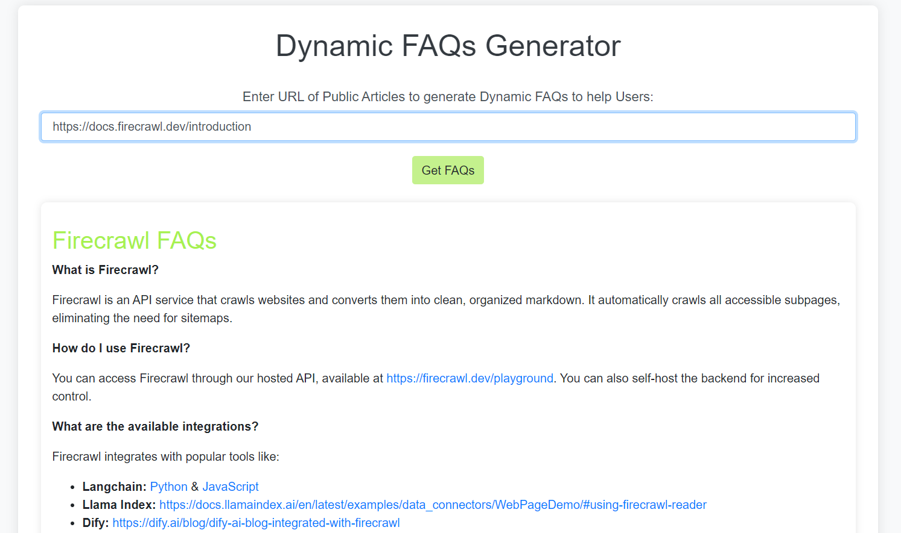

# Dynamic FAQs Generator

## Overview

This project is a Dynamic FAQs Generator built using Flask. It generates a list of important FAQs based on the content of a given article URL. The website utilizes the Firecrawl SDK to scrape website content and the Gemini API to analyze and extract key FAQs from the page content.

## Features

- **Scrape Article Content:** Extracts content from the provided article URL using the Firecrawl SDK.
- **Generate FAQs:** Analyzes the extracted content and generates a list of relevant FAQs using the Gemini API.
- **User-Friendly Interface:** A simple web interface that allows users to input article URLs and receive a set of FAQs.

## Prerequisites

- Python 3.8+
- Flask
- Firecrawl SDK
- Gemini API

## Visuals

